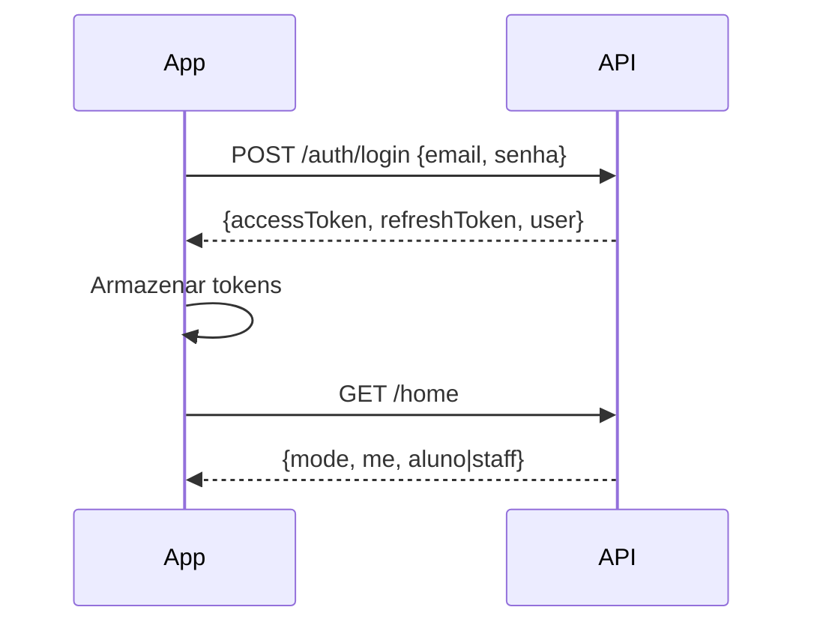
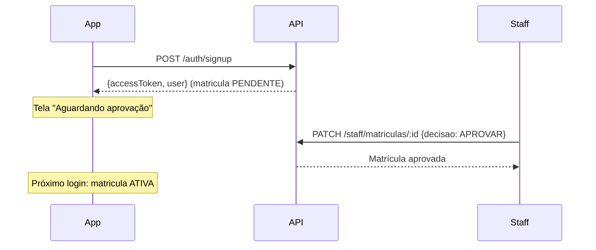
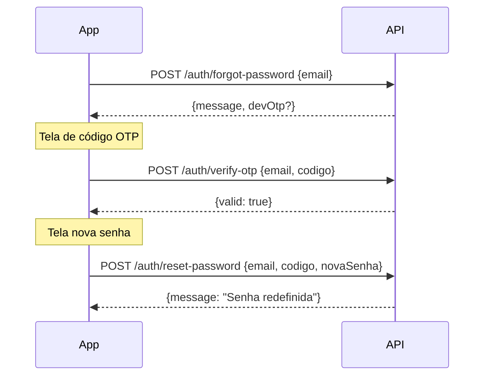
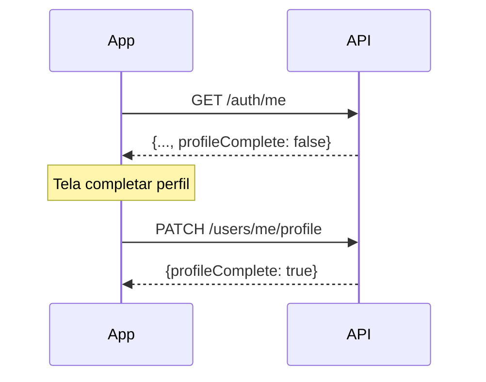
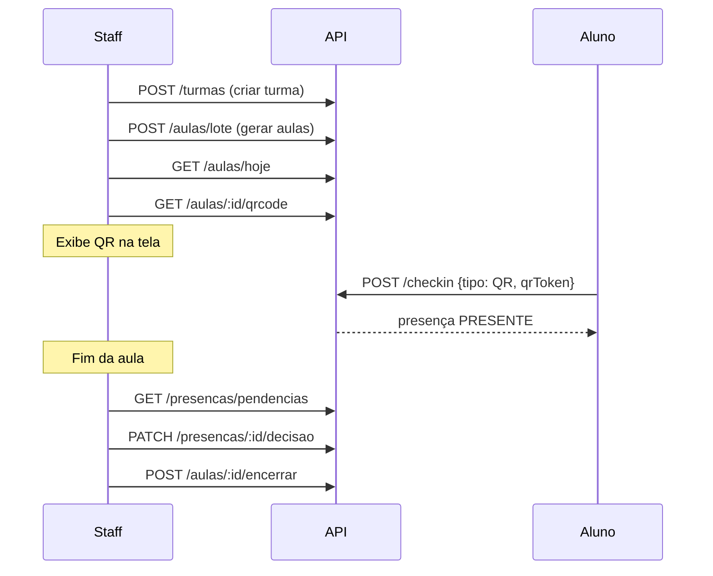

# Fluxos do App

> Fluxos "app-first" para desenvolvimento do cliente mobile/PWA.

---

## 1. Login → Home



### Happy Path

1. `POST /v1/auth/login` com `{email, senha}`
2. Receber `accessToken` e dados do `user`
3. Armazenar token (SecureStorage recomendado)
4. `GET /v1/home` para tela inicial
5. Renderizar baseado em `mode` (ALUNO ou STAFF)

### Erros Comuns

| Código | Causa                  | Ação no App                         |
| ------ | ---------------------- | ----------------------------------- |
| 401    | Credenciais inválidas  | Mostrar erro, limpar campos         |
| 429    | Rate limit (5 req/60s) | Aguardar, mostrar "tente novamente" |

---

## 2. Signup Self-service → Matrícula PENDENTE



### Happy Path

1. `POST /v1/auth/signup` com:
   ```json
   {
     "nomeCompleto": "Nome do Aluno",
     "email": "email@example.com",
     "senha": "Senha123",
     "codigoAcademia": "ACAD46AF",
     "aceitouTermos": true
   }
   ```
2. Receber token (usuário já logado)
3. Verificar `matriculaStatus` em `/auth/me`
4. Se `PENDENTE`: mostrar tela de espera
5. Aguardar aprovação do staff

### Erros Comuns

| Código | Causa                   | Ação no App                  |
| ------ | ----------------------- | ---------------------------- |
| 400    | Email já cadastrado     | Sugerir login ou recuperação |
| 404    | Academia não encontrada | Verificar código             |

### ✅ Implementado

- Login de usuários PENDENTE agora funciona
- App mostra card explicativo em: Home, Check-in, Evolução, Histórico
- Decisão: PENDENTE **NÃO pode** fazer check-in (bloqueado na API)

---

## 3. Recuperação de Senha



### Happy Path

1. `POST /v1/auth/forgot-password` com `{email}`
   - Resposta nunca revela se email existe
   - Em dev: `devOtp` contém o código
2. Usuário recebe email (via Resend)
3. `POST /v1/auth/verify-otp` para validar código (sem consumir)
4. `POST /v1/auth/reset-password` para trocar senha
5. Redirecionar para login

### Timings

- OTP válido por **15 minutos**
- Após reset, OTP é consumido

---

## 4. Completar Perfil



### Happy Path

1. Após login, verificar `profileComplete` em `/auth/me`
2. Se `false`: forçar tela de perfil
3. `PATCH /v1/users/me/profile` com:
   ```json
   {
     "telefone": "+5511999999999",
     "dataNascimento": "1990-05-15"
   }
   ```
4. Ambos os campos preenchidos → `profileComplete: true`

---

## 5. Fluxo Staff: Aula Completa



### Passos Detalhados

#### 5.1 Criar Turma

```bash
POST /v1/turmas
{
  "nome": "Gi Adulto Noite",
  "tipoTreinoId": "gi",
  "diasSemana": [1, 3, 5],  # Seg, Qua, Sex
  "horaInicio": "19:30",
  "horaFim": "21:00",
  "instrutorPadraoId": null
}
```

#### 5.2 Gerar Aulas em Lote

```bash
POST /v1/aulas/lote
{
  "turmaId": "uuid",
  "fromDate": "2025-01-01",
  "toDate": "2025-01-31"
}
```

Usa `diasSemana`, `horaInicio` e `horaFim` da turma.

#### 5.3 Gerar QR Code

```bash
GET /v1/aulas/{aulaId}/qrcode
→ { qrToken, expiresAt }
```

TTL padrão: 5 minutos (`QR_TTL_MINUTES`).

#### 5.4 Check-in do Aluno

```bash
POST /v1/checkin
{
  "aulaId": "uuid",
  "tipo": "QR",
  "qrToken": "token-do-qr"
}
```

- QR válido → `status: PRESENTE`
- MANUAL → `status: PENDENTE`

#### 5.5 Decisão de Pendências

```bash
# Listar
GET /v1/presencas/pendencias

# Decidir individual
PATCH /v1/presencas/{id}/decisao
{ "decisao": "APROVAR" }

# Decidir em lote
POST /v1/presencas/pendencias/lote
{ "ids": ["uuid1", "uuid2"], "decisao": "APROVAR" }
```

#### 5.6 Encerrar Aula

```bash
POST /v1/aulas/{aulaId}/encerrar
```

- Muda status para `ENCERRADA`
- Limpa QR token
- Idempotente

---

## Tratamento de Erros Global

| Código | Significado              | Ação Recomendada                |
| ------ | ------------------------ | ------------------------------- |
| 400    | Payload inválido         | Validar campos no app           |
| 401    | Token ausente/expirado   | Redirecionar para login         |
| 403    | Sem permissão            | Mostrar mensagem, esconder ação |
| 404    | Recurso não encontrado   | Atualizar lista local           |
| 409    | Conflito (duplicidade)   | Informar usuário                |
| 422    | Regra de negócio violada | Mostrar mensagem específica     |
| 429    | Rate limit               | Retry com backoff               |
| 500    | Erro interno             | Mostrar erro genérico           |
