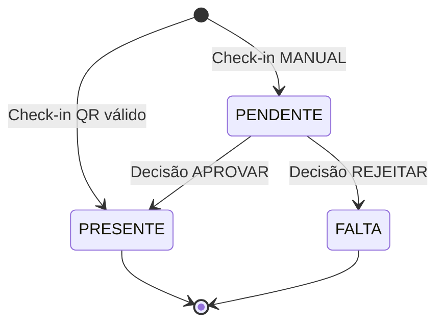

# Presenças e Aulas - Regras de Negócio

> Documentação detalhada das regras de negócio para aulas e presenças.

---

## Status de Aula

| Status      | Descrição                   | Transições Permitidas    |
| ----------- | --------------------------- | ------------------------ |
| `AGENDADA`  | Aula futura ou em andamento | → ENCERRADA, → CANCELADA |
| `ENCERRADA` | Aula finalizada             | (terminal)               |
| `CANCELADA` | Aula cancelada              | (terminal)               |

### Regras

- Aula nasce como `AGENDADA`
- `POST /aulas/:id/encerrar` → muda para `ENCERRADA`
- Não é possível encerrar aula `CANCELADA` (retorna `409`)
- Cancelar via `PATCH /aulas/:id` com `{status: "CANCELADA"}`

---

## Status de Presença

| Status     | Descrição                   | Origem                 |
| ---------- | --------------------------- | ---------------------- |
| `PENDENTE` | Aguardando decisão do staff | Check-in MANUAL        |
| `PRESENTE` | Aluno presente confirmado   | Check-in QR ou decisão |
| `FALTA`    | Ausência registrada         | Decisão do staff       |

### Fluxo de Status



---

## Regra de Unicidade (422)

```sql
UNIQUE (aula_id, aluno_id)
```

**Um aluno só pode ter UMA presença por aula.**

| Tentativa                      | Resultado                     |
| ------------------------------ | ----------------------------- |
| Segundo check-in na mesma aula | `422 Unprocessable Entity`    |
| Presença manual duplicada      | `409 Conflict` ou idempotente |

### Resposta de Erro

```json
{
  "statusCode": 422,
  "error": "Unprocessable Entity",
  "message": "Aluno ja possui check-in nesta aula",
  "details": {
    "aulaId": "uuid-aula",
    "alunoId": "uuid-aluno"
  }
}
```

---

## Decisão de Presença

### Endpoint

```
PATCH /v1/presencas/:id/decisao
```

### Payload

```json
{
  "decisao": "APROVAR", // ou "REJEITAR", "PRESENTE", "FALTA"
  "observacao": "Texto opcional"
}
```

### Mapeamento

| Valor `decisao` | Status Resultante |
| --------------- | ----------------- |
| `APROVAR`       | `PRESENTE`        |
| `PRESENTE`      | `PRESENTE`        |
| `REJEITAR`      | `FALTA`           |
| `FALTA`         | `FALTA`           |

### Idempotência vs Conflito

| Situação                                   | Resultado             |
| ------------------------------------------ | --------------------- |
| Presença `PENDENTE`                        | ✅ Decide normalmente |
| Presença já `PRESENTE`, decisão `APROVAR`  | ✅ Idempotente (200)  |
| Presença já `PRESENTE`, decisão `REJEITAR` | ❌ `409 Conflict`     |
| Presença já `FALTA`                        | ❌ `409 Conflict`     |

### Campos de Auditoria

Ao decidir, o sistema preenche:

- `decidido_em`: timestamp da decisão
- `decidido_por`: UUID do staff
- `decisao_observacao`: texto livre
- `updated_at`: atualizado via trigger

---

## Presença Manual (Staff)

### Endpoint

```
POST /v1/aulas/:id/presencas/manual
```

### Payload

```json
{
  "alunoId": "uuid",
  "status": "PRESENTE", // ou "FALTA"
  "observacao": "Registrado na recepção"
}
```

### Comportamento Anti-Duplicidade

| Estado Atual | Novo Status | Resultado            |
| ------------ | ----------- | -------------------- |
| Não existe   | PRESENTE    | ✅ Cria nova (201)   |
| Não existe   | FALTA       | ✅ Cria nova (201)   |
| PENDENTE     | PRESENTE    | ✅ Decide (200)      |
| PRESENTE     | PRESENTE    | ✅ Idempotente (200) |
| PRESENTE     | FALTA       | ❌ `409 Conflict`    |
| FALTA        | PRESENTE    | ❌ `409 Conflict`    |

### Origem

Presença manual tem `origem = 'SISTEMA'` (diferente de `MANUAL` do check-in do aluno).

---

## Encerrar Aula

### Endpoint

```
POST /v1/aulas/:id/encerrar
```

### Efeitos

1. Muda `status` para `ENCERRADA`
2. Preenche `data_fim` com `NOW()` se estiver nula
3. Limpa `qr_token` e `qr_expires_at`

### Características

- **Idempotente:** chamar múltiplas vezes retorna 200
- **Bloqueio:** se aula está `CANCELADA`, retorna `409`

### Resposta

```json
{
  "id": "uuid",
  "status": "ENCERRADA",
  "dataFim": "2025-12-18T22:30:00.000Z",
  "qrToken": null,
  "qrExpiresAt": null
}
```

---

## QR Code

### Gerar

```
GET /v1/aulas/:id/qrcode
```

### Campos na Aula

- `qr_token`: token criptograficamente seguro
- `qr_expires_at`: timestamp de expiração

### TTL

Configurável via `QR_TTL_MINUTES` (default: 5 minutos).

### Validação no Check-in

1. `qr_token` deve ser igual ao enviado
2. `qr_expires_at > NOW()`
3. Se expirado: `422` com mensagem "QR code expirado"

---

## Soft Delete

### Turmas

| Campo        | Descrição             |
| ------------ | --------------------- |
| `deleted_at` | Timestamp da exclusão |
| `deleted_by` | UUID do responsável   |

### Aulas

| Campo        | Descrição             |
| ------------ | --------------------- |
| `deleted_at` | Timestamp da exclusão |

### Comportamento em Listagens

| Query Param           | Efeito                        |
| --------------------- | ----------------------------- |
| (default)             | Ignora deletados              |
| `includeDeleted=true` | Inclui deletados (staff only) |
| `onlyDeleted=true`    | Apenas deletados (staff only) |

---

## Delete de Turma com Aulas Futuras

### Regra

Não é permitido deletar turma que tenha aulas futuras não-deletadas.

### Verificação

```sql
SELECT COUNT(*) FROM aulas
WHERE turma_id = :turmaId
  AND deleted_at IS NULL
  AND data_inicio > NOW()
```

### Resultado

| Aulas Futuras | Resultado           |
| ------------- | ------------------- |
| 0             | ✅ Delete permitido |
| > 0           | ❌ `409 Conflict`   |

### Resposta de Erro

```json
{
  "statusCode": 409,
  "error": "Conflict",
  "message": "Turma possui aulas futuras. Cancele ou delete as aulas primeiro."
}
```

### Solução

Antes de deletar a turma:

1. Cancelar aulas futuras: `PATCH /aulas/:id {status: "CANCELADA"}`
2. Ou deletar aulas: `DELETE /aulas/:id`
3. Depois: `DELETE /turmas/:id`

---

## Restore de Turma

### Endpoint

```
POST /v1/turmas/:id/restore
```

### Regra

Não pode restaurar se já existe turma ativa com o mesmo nome na academia.

### Conflito

```json
{
  "statusCode": 409,
  "error": "Conflict",
  "message": "Ja existe turma ativa com este nome"
}
```

---

## Timezone e "Hoje"

### Configuração

```env
APP_TIMEZONE=America/Sao_Paulo
```

### Cálculo

O backend calcula a janela de "hoje":

```sql
[startUtc, endUtc) = date_trunc('day', NOW() AT TIME ZONE 'America/Sao_Paulo')
```

### Endpoints Afetados

- `GET /aulas/hoje`
- `GET /presencas/pendencias` (sem params)
- `GET /dashboard/staff` (contadores)
- `GET /checkin/disponiveis`

### Filtros Explícitos

Para outros períodos, use:

- `?date=YYYY-MM-DD` (dia específico)
- `?from=ISO&to=ISO` (range, sempre em par)
